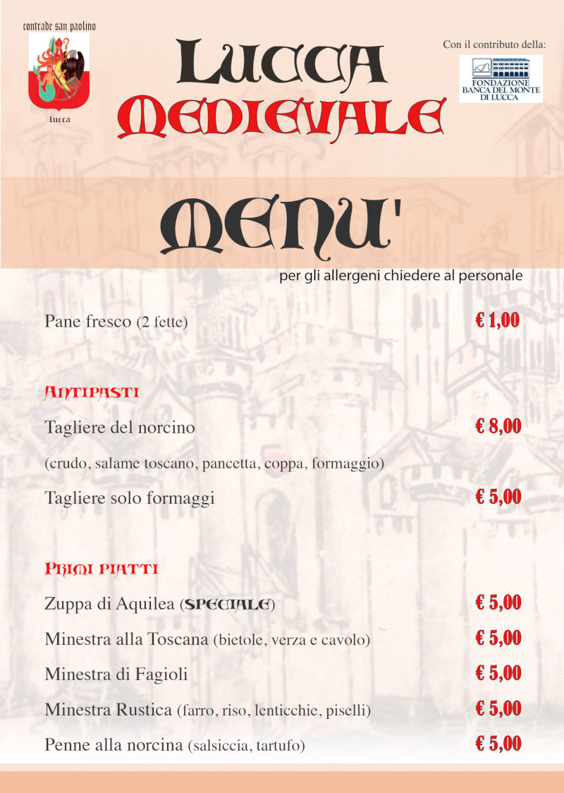
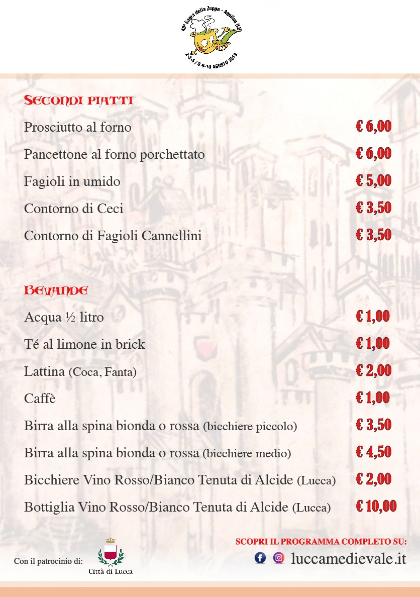

# Guida a Lucca Medievale 2019

Per il quarto anno consecutivo, ritorna a Lucca il festival del medioevo fra
storia, gastronomia e spettacolo!

* Quando: **1-2 Giugno 2019**
* Dove: [**Giardini Ex-Cavallerizza**](https://goo.gl/maps/1a3t4Q2pQhM32Vfo8) (ingresso da Porta Sant'Anna/Piazzale Verdi o Porta San Donato, Lucca)

Le novità di quest'anno:

* espansione dell'area della manifestazione fino a Porta San Donato, che l'anno
  scorso era interdetta causa lavori in corso
* più di 20 artigiani nel villaggio medievale
* 5 gruppi di rievocatori fra balestrieri, arcieri, combattenti e falconieri
* 5 gruppi di artisti di strada che intratterranno il pubblico con i loro spettacoli
* desco medievale (area gastronomica) completamente rinnovata!

Scopri tutti i protagonisti di questa edizione sulla pagina dell'[Evento Facebook](https://www.facebook.com/events/2088772917854661/)!

## La manifestazione

[Scarica il programma completo](https://bit.ly/programma-lucca-medievale-2019){: .myButton}

## Desco medievale

Ecco le più importanti novità riguardo lo stand gastronomico all'interno della manifestazione:

* Menù rinnovato e gestito dall'oste de [La Bottega di Anna e Leo](https://www.tripadvisor.it/Restaurant_Review-g187898-d7321080-Reviews-La_Bottega_di_Anna_e_Leo-Lucca_Province_of_Lucca_Tuscany.html)
* La famosa **Zuppa di Aquilea** in trasferta a Lucca Medievale!
* Piatti, posate e bicchieri 100% biodegradabili

### Menù

## Non perdere le prossime novità

Ti consigliamo di iscriverti alla nostra [newsletter](http://eepurl.com/dbx8K9)
per non perdere nessun aggiornamento sulle nostre manifestazioni e sulle future
edizioni di Lucca Medievale!

[Iscriviti alla newsletter](http://eepurl.com/dbx8K9){: .myButton}

## Parcheggi consigliati vicino Lucca Medievale

Dall'uscita dell'**autostrada Lucca Est**, proseguire dritto in direzione della
città tenendo le mura alla propria destra. **Porta Sant'Anna** è la prima porta che
si incontra, **Porta San Donato** quella successiva (ingresso pedonale per Lucca
Medievale). L'ingresso del **Parcheggio Palatucci** è sulla sinistra passata Porta
San Donato.

* [Parcheggio Palatucci](https://goo.gl/maps/CECta2Q5xA32) (2 minuti a piedi): 1 €/h, giornaliero 8 €.
* [Parcheggio Piazzale Don Franco Baroni](https://goo.gl/maps/aHb6Yczwc5s) (15 minuti a piedi): gratuito.

Guarda la [mappa](https://drive.google.com/open?id=1C59kj6DtvDMxeZ8tSaU__ef3Bf37aAXc&usp=sharing) con tutti i luoghi.

## Dormire a Lucca e dintorni nei giorni di Lucca Medievale

Per chi avesse bisogno di un posto letto, abbiamo stipulato una tariffa "Lucca
Medievale 2019" con diverse strutture:

* [Ostello La Salana](http://www.ostellolasalana.it/) a Capannori, a 15 minuti
  di auto da Lucca Medievale: posto letto in dormitorio € 18,00 a notte, camera
  quadrupla a uso doppia € 45,00 a notte, altre soluzioni disponibili:
  info@ostellolasalana.it - tel 339 7237912
* [Hotel Bernardino ★★★](http://www.hotelbernardino.com/) subito fuori le mura
  di Lucca, a 5 minuti di auto da Lucca Medievale: camera doppia a € 65,00 senza
  colazione, altre soluzioni disponibili: info@hotelbernardino.com - tel 0583 953356
* [Hotel Napoleon ★★★★](https://www.hotelnapoleonlucca.com/lucca-medievale.html)
  vicino il casello autostradale, a 10 minuti a piedi da Lucca Medievale, camera
  doppia a € 90 con colazione, altre soluzioni disponibili:
  info@hotelnapoleonlucca.com - tel 0583 316516

## Iscriviti alla newsletter

Vuoi ricevere comodamente nella tua casella di posta il programma di Lucca Medievale?



## Seguici sui Social

Usa l'hashtag **#luccamedievale** per pubblicare i tuoi contenuti!

* [Facebook](https://www.facebook.com/luccamedievale/)
* [Instagram](https://www.instagram.com/explore/tags/luccamedievale/)
* [YouTube](https://www.youtube.com/playlist?list=PLGmFjg-_N7COfovMy0z5-9uYcLXp1Tec-)

## Contattaci

Per qualsiasi altra domanda puoi contattarci tramite:

* [email](mailto:consanpaolino@gmail.com)
* [messaggio facebook](https://www.facebook.com/luccamedievale/)

## Gallerie edizione 2018

### Giuseppe Leonardi



### Tommaso Giannini



### Riccardo Bonuccelli



## Passate edizioni

* [2018](2018.md)
* [2017](2017.md)
* [2016](2016.md)


