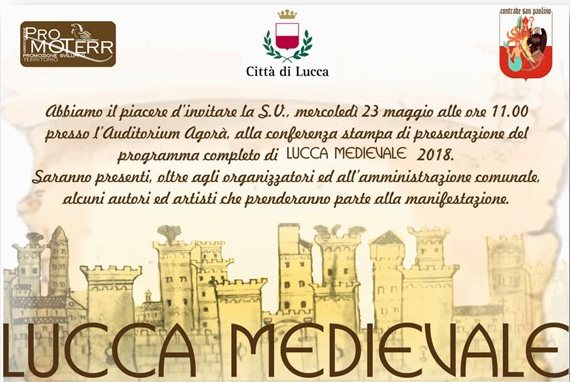

# Lucca Medievale 2018

La preparazione dell'evento Lucca Medievale è ormai agli sgoccioli, che si terrà
il 2-3 Giugno 2018 nell'area di Piazzale Verdi (Giardini del Museo della Zecca).

## Programma definitivo

For the **English-speaking** folks, [download this PDF](/assets/files/2018/Lucca-Medievale-2018-english.pdf)

### Presentazione della manifestazione

Abbiamo il piacere d'invitarvi mercoledì 23 Maggio 2018 alle ore 11.00 presso
l'auditorium della Bibloteca Agorà di Lucca, alla conferenza stampa di
presentazione del programma completo di **Lucca Medievale 2018**.

Saranno presenti, oltre agli organizzatori e all'amministrazione comunale,
alcuni autori e artisti che prenderanno parte alla manifestazione.

Per ricevere il programma con tutti gli spettacoli direttamente nella tua casella di posta, puoi [iscriverti alla newsletter](http://eepurl.com/dbx8K9).

### Espositori

Se sei un espositore e vuoi partecipare al mercatino, [scarica la scheda e rimandala compilata](/assets/images/2018/modulo-espositori.jpg) a **[segreteria@promo-terr.it](mailto:segreteria@promo-terr.it)**.

### Artisti

Per la parte artistica, hanno titolo preferenziale gli artisti di queste categorie:

* Falconieri
* Mangiafuoco
* Trampolieri
* Giocolieri
* Saltimbanchi
* Burattinai
* Musici
* Artisti di strada a tema medievale (no luci o coreografie moderne)
* Spettacoli itineranti a tema medievale
* Artigiani del ferro, cuoio, impagliatori e altri mestieri medievali

Utilizza uno dei metodi sottostanti per metterti in contatto con noi.

## Contatti

Per qualsiasi domanda puoi scriverci tramite:

* [segreteria@promo-terr.it](mailto:segreteria@promo-terr.it)
* [messaggio facebook](https://www.facebook.com/luccamedievale/)

## Newsletter

<!-- Begin MailChimp Signup Form -->
<link href="//cdn-images.mailchimp.com/embedcode/slim-10_7.css" rel="stylesheet" type="text/css">

<form action="//consanpaolino.us5.list-manage.com/subscribe/post?u=be5b31284c803823eb8c27688&amp;id=3a187109ba" method="post" id="mc-embedded-subscribe-form" name="mc-embedded-subscribe-form" class="validate" target="_blank" novalidate>
    

	<label for="mce-EMAIL">Iscriviti alla newsletter per rimanere aggiornato sugli eventi di Lucca Medievale</label>
	<input type="email" value="" name="EMAIL" class="email" id="mce-EMAIL" placeholder="email" required>
    <!-- real people should not fill this in and expect good things - do not remove this or risk form bot signups-->
    
<input type="text" name="b_be5b31284c803823eb8c27688_3a187109ba" tabindex="-1" value="">

    
<input type="submit" value="Iscriviti" name="subscribe" id="mc-embedded-subscribe" class="button">

    

</form>

<!--End mc_embed_signup-->

## Passate edizioni

* [2017](2017.md)
* [2016](2016.md)

## Social

Usa l'hashtag #luccamedievale per pubblicare i tuoi contenuti!

* [Facebook](https://www.facebook.com/luccamedievale/)
* [Instagram](https://www.instagram.com/explore/tags/luccamedievale/)
* [YouTube](https://www.youtube.com/playlist?list=PLGmFjg-_N7COfovMy0z5-9uYcLXp1Tec-)

## Lucca Medievale su YouTube

<iframe width="560" height="315" src="https://www.youtube.com/embed/videoseries?list=PLGmFjg-_N7COfovMy0z5-9uYcLXp1Tec-&amp;showinfo=0" frameborder="0" allowfullscreen></iframe>

